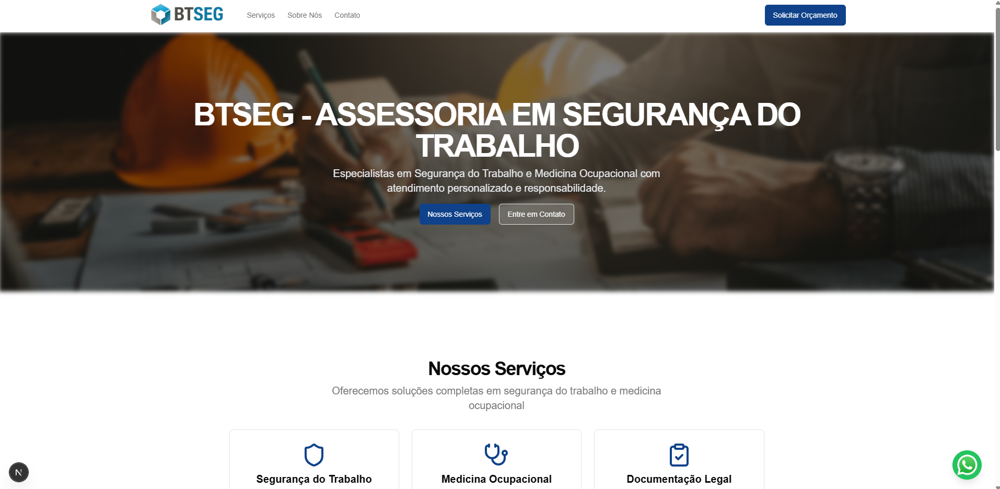
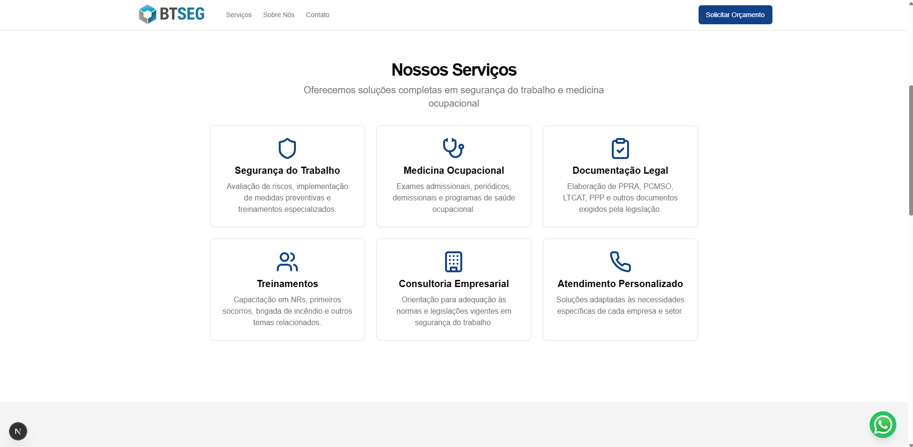
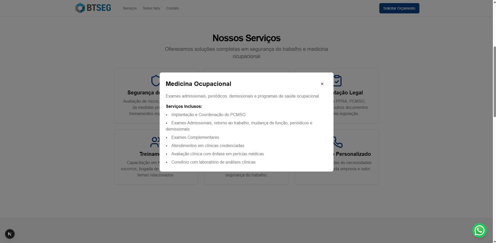

# BTSEG - Assessoria em Segurança do Trabalho


## 📋 Sobre o Projeto

Este é o site institucional da BTSEG - Assessoria em Segurança do Trabalho, desenvolvido com Next.js 14 e Tailwind CSS. O site apresenta informações sobre os serviços de segurança do trabalho e medicina ocupacional oferecidos pela empresa.

### 🚀 Tecnologias Utilizadas

- [Next.js 14](https://nextjs.org/)
- [Tailwind CSS](https://tailwindcss.com/)
- [TypeScript](https://www.typescriptlang.org/)
- [Lucide Icons](https://lucide.dev/)
- [Shadcn/ui](https://ui.shadcn.com/)

## 🖼️ Screenshots

### Página Inicial


### Seção de Serviços


### Modal de Detalhes


## 🛠️ Como Executar

### Pré-requisitos

- Node.js 18.17 ou superior
- npm ou yarn

### Instalação

1. Clone o repositório:
```bash
git clone https://github.com/seu-usuario/btseg.git
cd btseg
```

2. Instale as dependências:
```bash
npm install
# ou
yarn install
```

3. Execute o projeto em modo de desenvolvimento:
```bash
npm run dev
# ou
yarn dev
```

4. Abra [http://localhost:3000](http://localhost:3000) no seu navegador.

### Build para Produção

Para criar uma build de produção:

```bash
npm run build
# ou
yarn build
```

Para iniciar o servidor de produção:

```bash
npm run start
# ou
yarn start
```

## 📁 Estrutura do Projeto

```
btseg/
├── app/
│   ├── page.tsx
│   └── layout.tsx
├── components/
│   ├── ui/
│   │   ├── button.tsx
│   │   └── modal.tsx
│   ├── header.tsx
│   ├── hero-section.tsx
│   ├── services-section.tsx
│   ├── about-section.tsx
│   └── contact-section.tsx
├── public/
│   ├── banner.png
│   ├── logo.svg
│   └── whatsapp.svg
└── styles/
    └── globals.css
```

## 🤝 Contribuindo

1. Faça um Fork do projeto
2. Crie uma branch para sua feature (`git checkout -b feature/AmazingFeature`)
3. Commit suas mudanças (`git commit -m 'Add some AmazingFeature'`)
4. Push para a branch (`git push origin feature/AmazingFeature`)
5. Abra um Pull Request

## 📝 Licença

Este projeto está sob a licença MIT. Veja o arquivo [LICENSE](LICENSE) para mais detalhes.

## 📞 Contato

BTSEG - Assessoria em Segurança do Trabalho
- Website: [www.btseg.com](http://www.btseg.com)
- Email: contato@btseg.com
- Telefone: (11) 97053-1074
